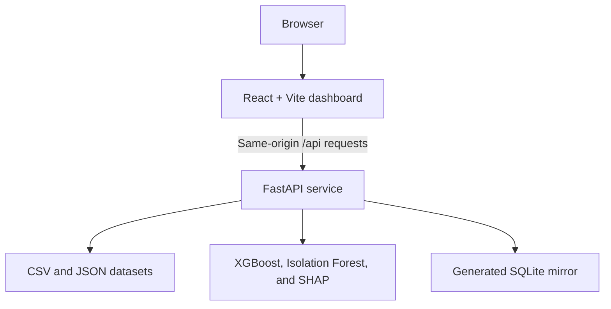

# Industrial Safety Intelligence Platform


A full-stack industrial-safety dashboard built with React, FastAPI, pandas,
XGBoost, Isolation Forest, and SHAP. It combines the bundled sensor, worker,
equipment, permit, incident, weather, maintenance, and plant-layout datasets to
produce dashboards, alerts, risk predictions, incident insights, and recommended
actions.

> **Important:** This repository is a demonstration and analytics project. It is
> not a certified safety system and must not be the sole basis for operational or
> emergency decisions.

## Features

- Overall safety-risk KPIs and active alerts
- Latest sensor readings and equipment-health snapshots
- Worker location and PPE-compliance monitoring
- Incident and maintenance analytics
- XGBoost risk and incident-probability models
- Isolation Forest anomaly detection
- Compound-risk detection across equipment, permits, and worker presence
- Data-driven safety recommendations
- SHAP explanations when SHAP is enabled
- Responsive Material UI dashboard with configurable refresh intervals
- Interactive FastAPI/OpenAPI documentation

## Architecture



In production, Docker builds the React application and copies it into the Python
image. FastAPI then serves both the compiled frontend and the API from one process
and one URL.

## Repository layout

```text
.
├── backend/
│   ├── backend.py              # FastAPI app, data loading, and API routes
│   ├── ai_engine.py            # Feature engineering and ML logic
│   ├── requirements.txt        # Python dependencies
│   └── data/                   # Bundled CSV and JSON datasets
├── industrial-frontend/
│   ├── src/                    # React and TypeScript source
│   ├── package.json
│   └── package-lock.json
├── Dockerfile                  # Multi-stage frontend/backend image
├── render.yaml                 # One-click Render configuration
└── README.md
```

## Dataset files

| File | Purpose |
|---|---|
| `sensor_data.csv` | Equipment measurements and observed risk levels |
| `worker_location.csv` | Worker location, work status, and PPE fields |
| `permit_log.csv` | Work permits linked to equipment and zones |
| `equipment_health.csv` | Health scores, faults, and remaining useful life |
| `incident_history.csv` | Historical safety incidents |
| `weather_data.csv` | Weather and heat-index measurements |
| `maintenance_schedule.csv` | Planned equipment maintenance |
| `plant_layout.json` | Plant zones and layout metadata |

## Prerequisites

For the recommended Docker setup:

- Git
- Docker Desktop or Docker Engine
- At least 2 GB of memory available to Docker for the full model configuration

For native development without Docker:

- Python 3.11
- Node.js 20 or 22
- npm

## Quick start with Docker

This is the simplest way to reproduce the complete production application.

```bash
git clone https://github.com/mukharbajpai/industrial-safety-ETGenAI.git
cd industrial-safety-ETGenAI
docker build -t industrial-safety-etgenai .
docker run --rm -p 10000:10000 -e PORT=10000 industrial-safety-etgenai
```

Open:

- Dashboard: <http://localhost:10000>
- Health check: <http://localhost:10000/api/health>
- API documentation: <http://localhost:10000/docs>

The first startup can take a few minutes because the datasets are loaded and the
models are trained before the application becomes ready.

## Run locally for development

Run the backend and frontend in separate terminals.

### 1. Start the backend on Windows PowerShell

```powershell
cd backend
py -3.11 -m venv .venv
.\.venv\Scripts\python.exe -m pip install --upgrade pip
.\.venv\Scripts\python.exe -m pip install -r requirements.txt
.\.venv\Scripts\python.exe backend.py
```

### 1. Start the backend on macOS or Linux

```bash
cd backend
python3.11 -m venv .venv
source .venv/bin/activate
python -m pip install --upgrade pip
python -m pip install -r requirements.txt
python backend.py
```

The backend is available at <http://localhost:8000>.

### 2. Start the frontend

In `industrial-frontend/`, create a file named `.env.local`:

```dotenv
VITE_API_BASE_URL=http://localhost:8000/api
```

Then run:

```bash
cd industrial-frontend
npm ci
npm run dev
```

Open the Vite URL shown in the terminal, normally <http://localhost:5173>.

## Deploy the entire application on Render

The repository includes `render.yaml`, so the frontend, backend, model runtime,
health check, and free-tier settings are deployed as one Render web service.

1. Fork this repository, or obtain access to it.
2. Sign in to the [Render Dashboard](https://dashboard.render.com/) with GitHub.
3. Select **New → Blueprint**.
4. Connect the repository containing this project.
5. Confirm that Render detects the root-level `render.yaml` file.
6. Review the service and select **Deploy Blueprint**.
7. Wait for the Docker build and startup to finish. The initial deployment can
   take 10–20 minutes.
8. Open the `onrender.com` URL shown on the service page and verify
   `/api/health`.

Every new commit to the connected branch triggers another deployment.

### Render free-tier mode

Render's free instance has limited CPU and 512 MB RAM. The included Blueprint
therefore enables these settings:

| Variable | Render value | Effect |
|---|---:|---|
| `LOW_MEMORY_MODE` | `1` | Downcasts dataframe types, retains only the latest worker row, and bounds model-training data |
| `SKIP_SQLITE` | `1` | Avoids generating the unused SQLite mirror |
| `DISABLE_SHAP` | `1` | Avoids loading SHAP on the memory-constrained instance |
| `PREDICTION_INTERVAL_SECONDS` | `300` | Recalculates derived state every five minutes |

Free services can sleep after inactivity, so the first visit after a sleep may be
slow. Their filesystem is also ephemeral. This application recreates its derived
state from the bundled datasets whenever it starts.

## Configuration

| Variable | Default | Description |
|---|---:|---|
| `PORT` | `8000` locally | Port used by the FastAPI process |
| `VITE_API_BASE_URL` | `/api` | API base URL compiled into the React frontend |
| `PREDICTION_INTERVAL_SECONDS` | `60` | Background prediction refresh interval |
| `LOW_MEMORY_MODE` | `0` | Enables dataframe and training-memory optimizations |
| `SKIP_SQLITE` | `0` | Skips creation of `backend/safety_intelligence.db` |
| `DISABLE_SHAP` | `0` | Disables SHAP explanations |
| `MAX_RISK_TRAIN_ROWS` | Unlimited | Maximum sampled rows for risk-model training |
| `MAX_ANOMALY_TRAIN_ROWS` | Unlimited | Maximum sampled rows for anomaly-detector training |
| `RISK_N_ESTIMATORS` | `200` | Number of risk-model trees |
| `INCIDENT_N_ESTIMATORS` | `150` | Number of incident-model trees |
| `MODEL_N_JOBS` | `-1` | Parallel model workers; `-1` uses all CPUs |

## Main API routes

| Route | Description |
|---|---|
| `GET /api/health` | Service and dataset-load status |
| `GET /api/dashboard/overall-risk` | Current overall risk score |
| `GET /api/dashboard/active-alerts` | Active safety alerts |
| `GET /api/sensors/live` | Latest sensor row per equipment item |
| `GET /api/equipment` | Latest equipment-health snapshot |
| `GET /api/workers` | Latest worker-location snapshot |
| `GET /api/incidents` | Filterable incident history |
| `GET /api/maintenance` | Maintenance schedule |
| `GET /api/weather/latest` | Latest weather record |
| `GET /api/ai/risk-predictions` | Per-equipment risk predictions |
| `GET /api/ai/incident-predictions` | Predicted incident probabilities |
| `GET /api/ai/compound-risks` | Cross-dataset compound risks |
| `GET /api/ai/recommendations` | Prioritized recommended actions |
| `GET /api/ai/model-status` | Training rows, metrics, and model status |
| `GET /api/ai/explain/{equipment_id}` | SHAP explanation when enabled |

The complete interactive API reference is available at `/docs` while the backend
is running.

## Verification

Check a local Docker deployment:

```bash
curl http://localhost:10000/api/health
```

A healthy response reports `"status": "healthy"` and lists the loaded datasets.
You can also verify the production frontend build independently:

```bash
cd industrial-frontend
npm ci
npm run build
```

## Troubleshooting

### The frontend reports a network error during local development

Confirm the backend is running on port 8000 and that
`industrial-frontend/.env.local` contains:

```dotenv
VITE_API_BASE_URL=http://localhost:8000/api
```

Restart `npm run dev` after changing a Vite environment file.

### Render reports an out-of-memory error

Confirm the four free-tier environment variables from `render.yaml` are visible
in the Render service settings. Do not remove `LOW_MEMORY_MODE=1` or
`DISABLE_SHAP=1` on a 512 MB instance.

### The first request is slow

Model initialization happens during startup. Render's free service can also wake
from sleep on the first request. Wait a few minutes and inspect the service logs
before restarting it.

### Local imports or packages are missing

Run Python through the virtual environment that installed
`backend/requirements.txt`. On Windows, using the full
`.\.venv\Scripts\python.exe` path avoids activation-policy problems.

## Updating a deployment

Push changes to the branch connected to Render:

```bash
git add .
git commit -m "Describe the change"
git push
```

Render automatically rebuilds the Docker image and deploys the new commit.
